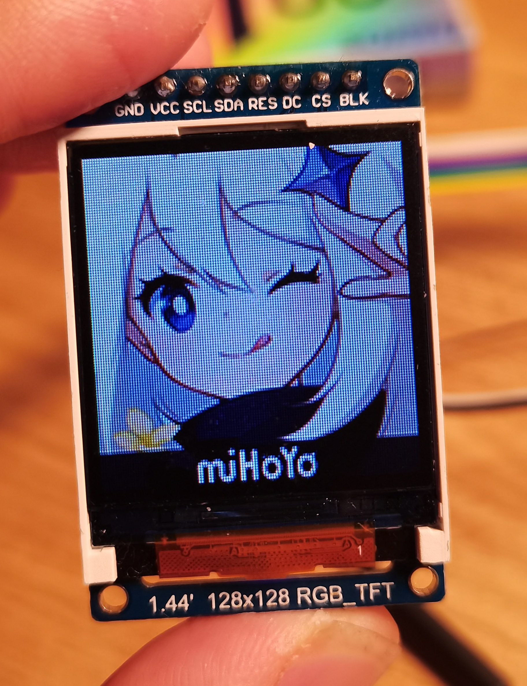
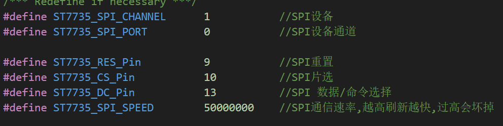
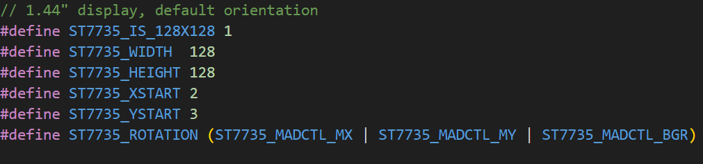
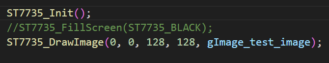

# ST7735 for wiringPi

### 简介

把stm32上的st7735驱动移植到使用wiringPi的设备上

### 设备支持情况

st7735 - 160*80

st7735 - 168*128

st7735 - 128*128

### 使用

**STEP1**

检查您的屏幕是否在可支持设备的列表内

**STEP2**

配置SPI设备

**STEP3**

取消注释对应的屏幕

**STEP4**

使用即可

### 参考

https://github.com/afiskon/stm32-st7735

